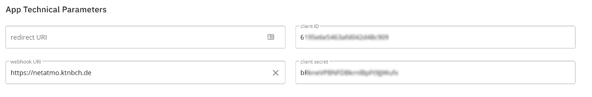

# Netatmo Smokedetector API to MQTT Gateway

## Description
This is a Python-Flask based software that can serve as a target for webhooks of the Netatmo API and receives the 
events of the Netatmo smoke detectors and then passes them on to an MQTT server and via Google Chat.
The software is intended to run in a Kubernets cluster.

This means that you can be notified of a smoke alarm event not only via the (terrible) Netatmo app, but also via Google 
Chat and MQTT. Together with a system such as Node-Red, any scenarios are then conceivable as to how to react to an 
incoming smoke alarm.

## Netatmo API
To use the service presented here, you need to create a developer account with Netatmo:
https://dev.netatmo.com/

You need to create a new client and supply the client-id and client-secret generated by Netatmo in the below
described configuration and the URL, that you configure and deploy your application to as the "webhook uri" in
the netatmo settings:



## Configuration
You need to configure the following environment variables either in your docker-compose.yaml (if you use docker with 
k8s), in environment section of your deployment or as a k8s-Secret reference in your deployment:

```
# URL used for the webhook - you need to fill this in the form of the Netatmo Developer account
# This is very important, otherwise netatmo won't call your URL
MY_URL=https://netatmo.example.com   

CLIENT_ID=6xxxxxxxxxxxxxxxxxx  # from Netatmo
CLIENT_SECRET=byyyyyyyyyyyyyy  # from Netatmo
USERNAME=myuser@mydomain.com   # Your user @Netatmo
PASSWORD=XYZXYZXZY             # Your password @Netatmo
DEVICEMAP={"70:ee:51:8d:5d:c2":"Device1", "70:ee:51:6d:5e:a4":"Device2", "70:ee:51:9c:4a:c1":"Device3"}
GCHAT_WEBHOOK_URL=https://chat.googleapis.com/v1/spaces/XXXXXYYYYYY/messages?key=akljsdfhaslkjdfhaslkjdfhaslkdjfhsakljdD
MQTT_SERVER=<MQTT Server IP or Hostname)>
MQTT_CLIENTID=<MQTT Server client id>
MQTT_USER=<MQTT Server Username>
MQTT_PASS=<MQTT Server Password
MQTT_TOPIC=<MQTT base topic to publish to>
```

`DEVICEMAP` is a JSON-object which maps MAC-adresse to names and is used to lookup the mac-adresse of the 
smokedetector, that the API posts to the webhook. The format is:

```
DEVICEMAP={
    "mac-address" : "the name you give this device"
}
```

If you don't need this, just leave the variable out or empty.

### MQTT
You need to create a user in your MQTT server. This is up to you and depdends on the server you use.

### Google Chat
The `GCHAT_WEBHOOK_URL` is a webhook that can be generated by the Google Chat client. 
See here: https://developers.google.com/chat/how-tos/webhooks

## Limitations
Attention: the token transmitted by Netatmo cannot (currently) be stored in a shared-storage, so when executed in k8s, only `replicas: 1` must be used. If you want more replicas, the token must be stored in a shared-storage system like redis.

